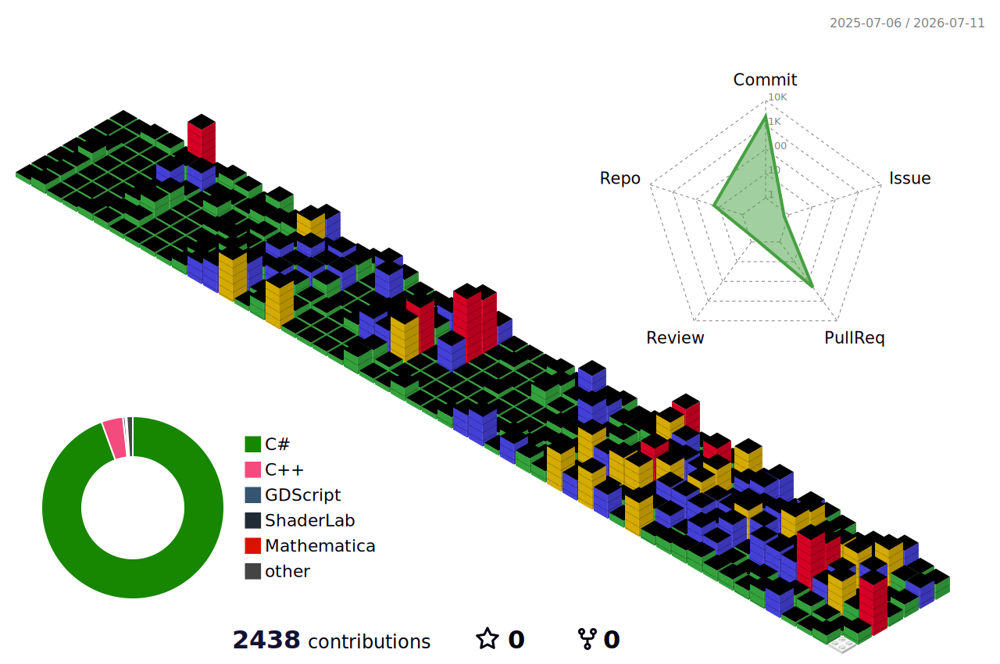

# 👋 안녕하세요, 게임 개발자 지망생 김진호입니다!

### 🚀 "즐거운 경험을 만드는 프로그래머를 꿈꿉니다"
이곳은 저의 고민과 노력이 담긴 프로젝트 저장소입니다. 자유롭게 둘러보세요!

 

## 🛠 Tech Stack
  
 
  

 
 

## 📊 GitHub Contributions

  
  
  

  

 

## 🏆 Problem Solving

 

## ✉️ Contact Me

 `kimjinho0481`

 

